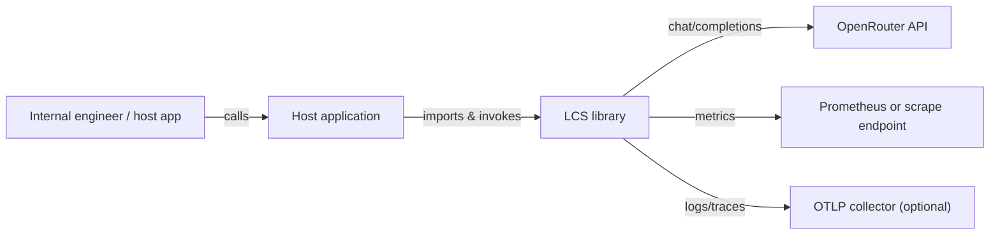

# C1 — Context

This document frames LCS within its environment: who uses it, which external systems it touches, and the constraints that shape its design.

LCS serves internal engineers who embed the library inside their own Python services or jobs. End users interact with those host applications, not with LCS directly. The only mandated external dependency is OpenRouter, which supplies LLM completions. Telemetry backends (Prometheus scrape target, OTLP collector) are optional but recommended. No databases or caches are bundled; state lives in memory for the duration of a request.

Data flow is simple: a host service passes a prompt and model list to LCS, the orchestrator gathers provider responses, computes consensus and optional quality scores, and returns the result to the host. Metrics count calls and durations but exclude prompt text; logs and traces are structured if you enable them. Privacy responsibilities, including redaction and retention, remain with the host application.

To validate this context, ensure the host environment can reach OpenRouter and that the intended telemetry sinks are reachable; running `poetry run pytest -q` confirms the library behaves correctly when those dependencies are mocked or absent.

---
Maintainer/Author: Rémi Boivin (@remiboivin021)
Version: 0.1.0
Last modified: 2026-02-03
---
