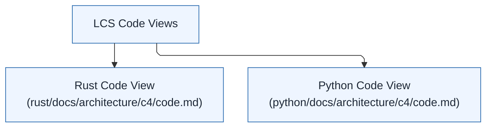

# Code View

This view summarizes the language-specific code views for LCS.

## Code View Context

Code views are language-specific because each service has its own module layout
and dependencies. The Rust and Python services define their code structure in
their respective C4 code views.

### Diagram (Mermaid)

## Technical Context

See `rust/docs/architecture/c4/code.md` and `python/docs/architecture/c4/code.md`
for the service-specific module diagrams and notes.
