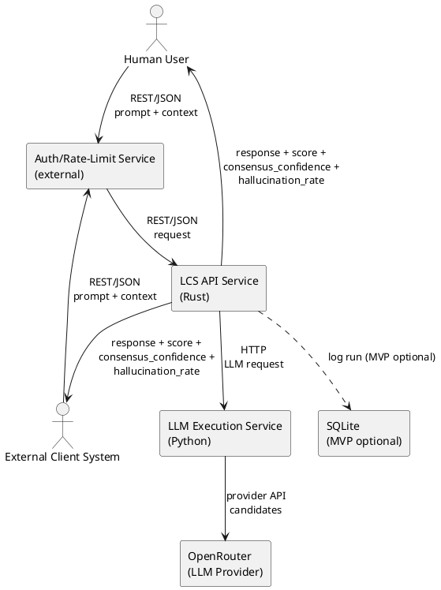

# Container View

This view decomposes LCS into deployable units and external dependencies. It
captures runtime boundaries that are relevant to operation and scaling.

## Container View Context

The Rust API service hosts the consensus core and exposes the REST/JSON API.
The Python LLM service encapsulates provider-specific logic and communicates
with OpenRouter. Authentication and rate limiting are enforced by an external
service positioned in front of LCS.

SQLite is optional in MVP and required in V1+ for run logging. No other runtime
data stores are required for MVP/V1.

### Diagram (PlantUML)

## Technical Context

The Python LLM service is the only component that communicates with OpenRouter.
This keeps provider-specific concerns isolated from the Rust consensus core.

The external Auth/Rate-Limit service is required for access control and is not
implemented inside LCS. Requests reaching LCS are assumed to have already passed
those controls.

Persistence is limited to logging and evaluation. V1+ logging does not provide
cross-request state or memory for runtime consensus behavior. V2 uses a NoSQL
store for long-term logging and system improvement.
