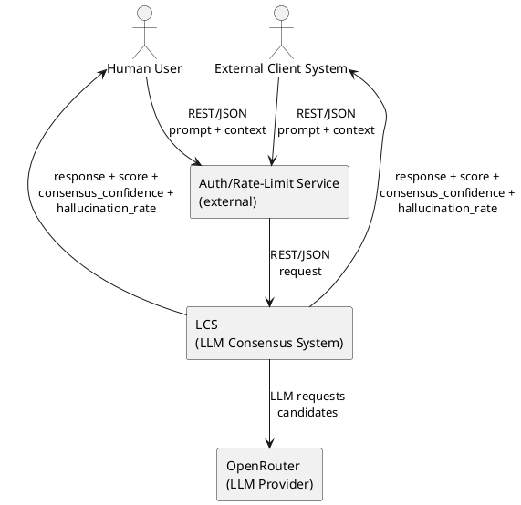

# Context and Scope

This view documents the system context and scope for LCS.

## Context View Context

LCS exists to provide a single consensus response when multiple LLM outputs are available. It is designed as a service that other systems can call over REST/JSON, so it can be embedded into larger workflows.

The primary usage model is request driven. Each request is self-contained and includes all required context. There is no conversational or cross-request state retained by the system.

LCS does not include training, UI, billing, or user management. Access control and rate limiting are external responsibilities and are handled outside of LCS.

The service is intended for use by humans and by automated client systems, and it is agnostic to the client implementation. The client remains responsible for the provenance of the provided context and for any upstream data collection.

LCS returns a consolidated response along with evaluation signals. Those signals exist to help callers assess output quality, but the interpretation and decision logic remain in the client domain.

The scope of LCS is intentionally narrow for MVP and V1. Expanding the scope to include tool access or web retrieval is reserved for later versions.

### Diagram (PlantUML)

## Technical Context

LCS exposes a REST/JSON interface for MVP and V1. The API contract defines the request and response structures, and it is versioned over time as the service evolves.

The system is stateless per request. Any stateful behaviors must be implemented by clients or by upstream services that wrap LCS.

Prompt and context persistence is not part of MVP. V1 logging is limited and does not introduce cross-request memory. In V2, offline persistence can be enabled in a NoSQL store for system improvement and analysis.

LCS interacts with an external LLM provider. The provider handles model execution and returns candidate outputs to LCS for consensus processing.

Authentication and rate limiting are external services positioned in front of LCS. LCS assumes that requests reaching the service have already passed those controls.

No web search is used in MVP or V1. Optional tool access via MCP is considered only for a later version and is not part of the current technical scope.

No data residency, regulatory, or compliance constraints are defined at this stage. If such constraints emerge, they will be handled by revising the context and the access boundaries.

The context boundary of LCS is therefore limited to consensus logic and its direct external interfaces. Any additional integrations must be explicitly introduced and validated before expanding this boundary.
