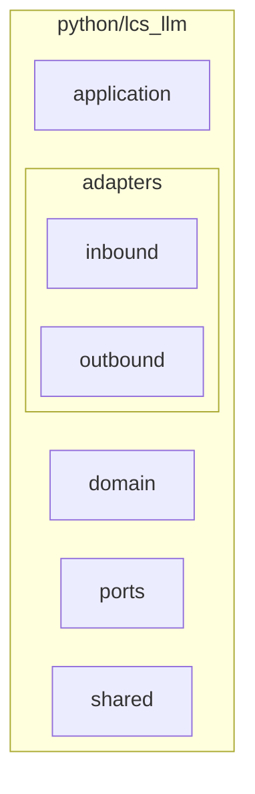

# Code View (Python)

This view describes the Python code-level structure aligned with the hexagonal
architecture.

## Code View Context

Python modules are organized under `python/lcs_llm` into domain, application,
ports, adapters, and shared packages. Inbound and outbound adapters are grouped
under the adapters namespace.

### Diagram (Mermaid)

## Technical Context

Python modules mirror the hexagonal layers used by Rust. The inbound adapter
hosts the HTTP handler, while the outbound adapter hosts the provider client.
