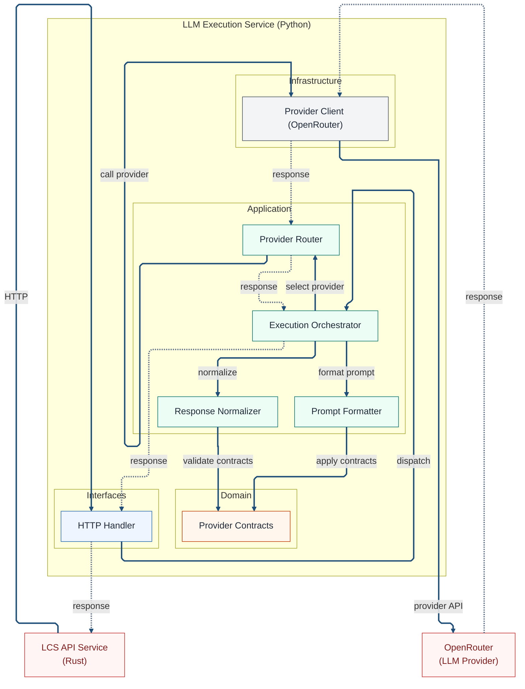

# Component View

This view decomposes the Python LLM service into layers. It shows how interface
components call application logic, which relies on domain contracts and
infrastructure adapters.

## Component Context

This component view focuses on the Python execution service that encapsulates
provider-specific behavior. It sits behind the Rust API service and isolates
model execution concerns from the consensus core. The intent is to show
ownership and coupling rather than restate every line in the diagram.

The flow is read from top to bottom as a dependency and control path. Solid
arrows represent direct calls between components, while dotted arrows represent
response paths back to the Rust API, with provider responses shown at the
boundary. Domain returns are implicit because those calls are in-process and do
not cross a boundary.

The service is request driven and stateless in MVP and V1. It does not hold
cross-request memory and does not persist prompts or outputs. Its role is to
format inputs, select a provider, execute the call, and normalize the response
into a stable shape for the caller.

OpenRouter is shown as the external provider because it is the only outbound
dependency at this layer. The execution service treats the provider as a black
box and keeps any provider changes behind the adapter boundary.

### Diagram (Mermaid)

## Technical Context

The Python service follows the same hexagonal layering principles as the rest
of LCS. Interfaces handle transport, the application layer coordinates the
workflow, the domain layer defines contracts, and infrastructure isolates IO.
Dependencies point inward and adapters implement ports defined by the core.

The HTTP handler owns decoding, response shaping, and error mapping. It
protects the internal workflow from transport details and exposes a stable
contract to the Rust API service. It does not embed provider logic or routing
rules.

The execution orchestrator coordinates the end-to-end workflow inside the
service. It prepares formatted prompts, selects a provider route, and invokes
the provider client through the infrastructure adapter. It also applies
normalization so that outputs are returned in a stable format.

Prompt formatting and response normalization are kept in the application layer
because they express policy for how the service shapes IO. These components use
provider contracts from the domain layer to enforce expected structure and
constraints without coupling to a specific provider.

Provider contracts define the expected request and response shapes for any
provider integration. They act as the stable boundary between provider logic
and the rest of the system, allowing new providers to be added without changing
application semantics.

The provider client is the infrastructure adapter that holds network behavior.
It performs HTTP calls, handles timeouts and retries at the boundary, and maps
provider errors into stable error types. The adapter remains replaceable and
keeps external dependencies out of the core workflow.

Error handling is explicit. Invalid inputs or provider failures are returned as
controlled errors, and the response shape is kept stable for the Rust caller.
The service does not keep state across requests, which simplifies scaling and
reduces coupling between runs.

This component view is designed to remain stable as providers evolve. New
provider clients can be added behind the same contracts, and the orchestrator
can route to them without changing the Rust consensus core. The separation of
concerns keeps provider-specific change isolated to the Python service.
