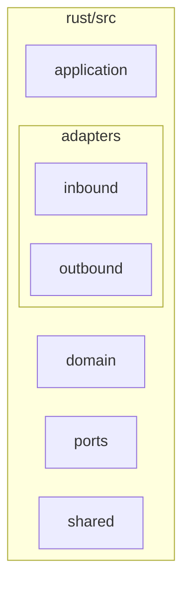

# Code View (Rust)

This view describes the Rust code-level structure aligned with the hexagonal
architecture.

## Code View Context

Rust modules are organized under `rust/src` into domain, application, ports,
adapters, and shared packages. Inbound and outbound adapters are grouped under
the adapters namespace.

### Diagram (Mermaid)

## Technical Context

Rust modules map to the hexagonal layers. The inbound adapters host the REST
controller and validation. Outbound adapters host integrations such as the HTTP
LLM adapter and storage adapters for run logging (MVP optional).
