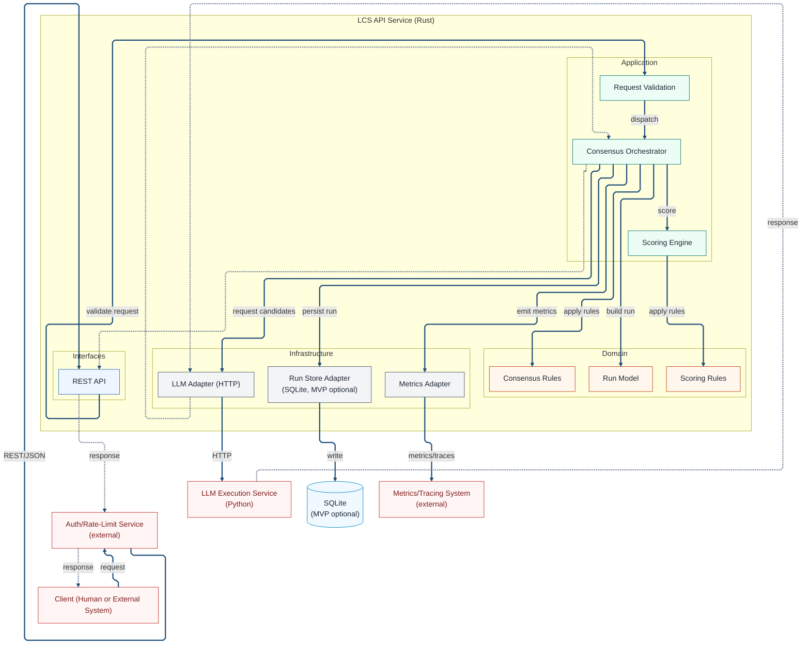

# Component View

This view decomposes the Rust API service into layers. It shows how interface
components call application logic, which relies on domain rules and
infrastructure adapters.

## Component Context

This component view focuses on the Rust API service that owns consensus and
scoring. It clarifies which responsibilities live inside the service boundary
and which ones are delegated to external systems. The intent is to explain
ownership and coupling rather than restate every connection in the diagram.

LCS is request driven and stateless in MVP and V1. Each request is handled as a
single unit of work and returns a single response payload. There is no
cross-request memory, and persistence is limited to run logging and offline
analysis. Logging is optional in MVP and required in V1+.

The entry path starts with a client calling the external Auth/Rate-Limit
service, which then forwards the request to the REST API. The dotted arrows
represent the end-to-end response path back to the client and are conceptual
rather than a timing diagram. Domain returns are implicit to keep the diagram
readable, since those calls are in-process and do not cross boundaries.

External dependencies are shown to expose operational boundaries. The Python
LLM execution service is the only component that communicates with providers.
SQLite is used for run logging in MVP and V1; it is optional in MVP and
required in V1+. Metrics and tracing systems are external and treated as
best-effort destinations.

### Diagram (Mermaid)

## Technical Context

The Rust API service follows a strict hexagonal layering model. Interfaces handle transport concerns, the application layer coordinates workflows, the domain layer expresses rules and invariants, and infrastructure hosts adapters for IO and external systems. Dependencies always point inward toward the domain, and adapters implement ports defined by the core.

The REST API interface owns decoding, schema validation, and response shaping.
It protects the core from HTTP and serialization details while exposing a stable public contract. This layer rejects malformed inputs early and forwards normalized requests into application logic.

The application layer coordinates consensus and scoring. It handles request validation, enforces limits and timeouts, and decides how to proceed when candidate data is incomplete. The orchestrator uses the execution port to retrieve candidates and then applies scoring according to domain rules.

The scoring engine remains internal because it is part of the core business logic. Scores are deterministic for a given input and are attached to the response as metadata. The scoring path does not call external systems and does not persist state across requests.

Domain logic defines what a valid consensus outcome means. The domain layer is pure and side-effect free, with explicit types and errors. It does not depend on HTTP, storage, or telemetry and is the main source of truth for consensus and
scoring behavior.

Infrastructure adapters isolate IO and provider details. The LLM adapter translates internal requests into provider calls and maps responses into candidate structures. The store adapter is optional in MVP and required in V1+ for
logging and evaluation, while the metrics adapter emits telemetry without influencing business decisions.

Error handling is explicit across all layers. Validation errors are returned to clients as stable error responses, and provider failures can trigger a degraded mode with partial results. Diagnostics are emitted without blocking request completion, and errors never silently alter the consensus logic.

The system is stateless and designed for horizontal scaling. Timeouts and request budgets prevent unbounded execution, and logging storage remains off the critical path. Performance and reliability are managed through orchestration policy rather than through hidden background work.

Security and access control are delegated to the gateway. The service assumes requests arriving at the REST API have already passed authentication and rate limits. Sensitive data is minimized in logs and metrics, and provider credentials are managed outside the core.

The component view is expected to remain stable as adapters evolve. New providers can be added by implementing new adapters, and storage backends can be replaced without changing domain rules. The same boundaries can support future FFI execution paths or additional tooling as the system matures.
